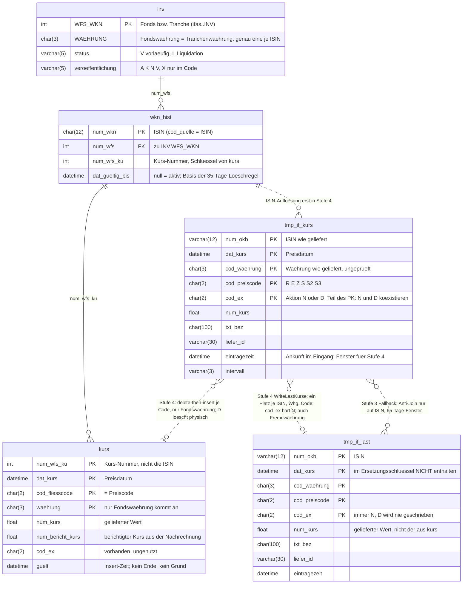
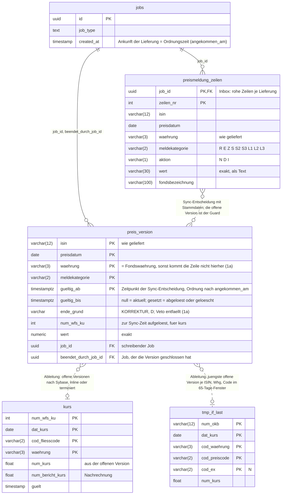
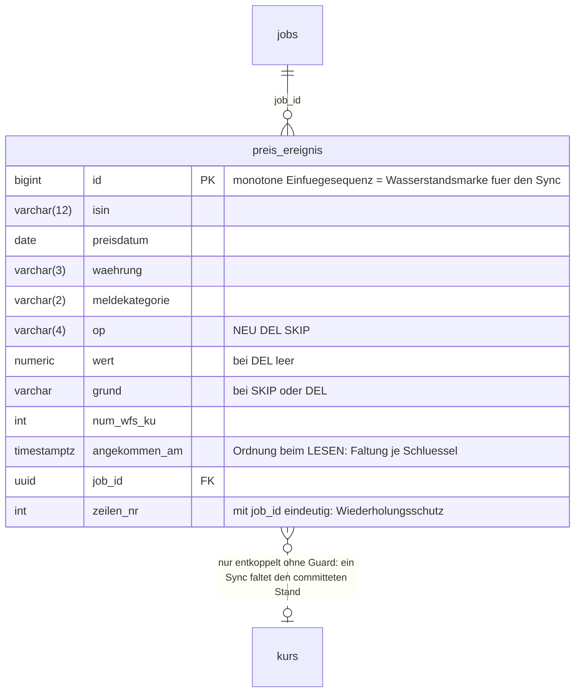
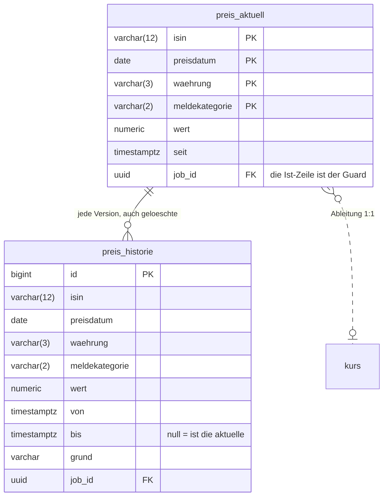

# Fondspreise — Entity-Diagramme: Altsystem und Neusystem mit Ledger-Varianten

Stand 2026-09-17. Begleitblatt zu
[Preis-Ledger — die Formen](2026-09-17-fondspreise-preis-ledger-formen.md); Begriffe dort in
Abschnitt 0. Diagramme als mermaid (IntelliJ-Vorschau, GitHub); als Deck gerendert in
`2026-09-17-fondspreise-preis-ledger-er-diagramme.deck.html` (braucht `_deck/mermaid.min.js` daneben).

**Lesart:** durchgezogene Linie = echter Schlüsselbezug (Fremdschlüssel oder Join), gestrichelte
Linie = Datenfluss oder Ableitung durch ein Programm bzw. eine Stufe. Kardinalitäten an gestrichelten
Linien sind Größenordnungen („viele Zeilen ergeben höchstens eine"), keine Constraints. Spaltenlisten
sind auf das Wesentliche gekürzt; Ledger-Namen und -Schlüssel sind **provisorisch**.

---

## 1. Altsystem — `kurs`-DB (Sybase), Stammdaten aus `ifas` und `vwkn`

Was das Diagramm zeigt:

| Punkt | Befund |
|---|---|
| **Zwei Identitäten** | Eingang und Projektion kennen die ISIN (`num_okb`), `kurs` kennt nur `num_wfs_ku`. Die Auflösung passiert in Stufe 4 über `wkn_hist`. |
| **Aktion im Schlüssel** | `cod_ex` ist in `tmp_if_kurs` Teil des PK. Ein `N` und ein `D` zum selben Preis stehen nebeneinander; wer gewinnt, entscheidet der Eingang (`Check4DeleteInTmp`) und die Verarbeitungsreihenfolge. |
| **Ein Platz je Schlüssel** | `tmp_if_last` hat den 5-spaltigen PK, aber `WriteLastKurse` löscht vor dem Insert über (ISIN, Whg, Code) **ohne** Datum. Der eine Platz ist Code, nicht Schema. |
| **Keine Zeit, kein Ende** | `kurs.guelt` ist die Insert-Zeit. Löschungen sind physisch, es bleibt nichts zurück. `eintragezeit` steuert nur das Verarbeitungsfenster. |
| **Währung** | `tmp_if_kurs` und `tmp_if_last` tragen die gelieferte Währung, `kurs` nur die Fondswährung. Genau dort laufen die drei Tabellen auseinander. |
| **Wert** | überall `float`. |

---

## 2. Neusystem — Inbox, Ledger (Variante A), abgeleitete Sybase-Tabellen

Postgres: `jobs` und `preismeldung_zeilen` (Job-System), das Ledger (Kontext
`business-new-introduced`). Sybase, Neusystem-Instanz, schema-gesperrt: `kurs`, `tmp_if_last`
(letztere nur, solange Klärung **O** offen ist).

Die heutigen Stufe-2-Tabellen `preis_herkunft` (Guard je `kurs`-Zeile) und `letzte_preise` (Guard
und Spiegel der Projektion) kommen im Diagramm nicht mehr vor: die offene `preis_version` übernimmt
den ersten Guard, die Abfrage der Projektion den zweiten (Formen-Dokument, 5a).

### Die Ledger-Varianten im Vergleich — nur die Ledger-Entität(en)

**A — Gültigkeitsintervalle** (oben): eine Zeile je Version, `gueltig_ab`/`gueltig_bis`, Grund an
der geschlossenen Zeile.

**B — Ereignis-Ledger**: eine Zeile je Operation, nie ein Update.

**C — Ist-Tabelle plus Historie**: zwei Tabellen, konsistent zu halten.

---

## 3. Alt gegen Neu — die Unterschiede auf einen Blick

| | Altsystem | Neusystem mit Ledger (A) |
|---|---|---|
| **Rohinput** | `tmp_if_kurs`, wird nach Stufe 4 nach `tmp_if_cop` kopiert und geleert | `preismeldung_zeilen`, bleibt; keine Kopie, kein Leeren |
| **Identität** | ISIN im Eingang, `num_wfs_ku` in `kurs`; Auflösung spät und still | beide Spalten am Ledger, Auflösung zur Sync-Zeit festgehalten |
| **Aktion** | `cod_ex` im PK von `tmp_if_kurs`; `D` löscht in `kurs` physisch | `D` schließt eine Version mit `ende_grund = D`; nichts verschwindet |
| **Korrektur** | delete-then-insert, alter Wert weg | alte Version geschlossen (`KORREKTUR`), neue geöffnet |
| **Zeit** | `eintragezeit` (Ankunft), `guelt` (Insert-Zeit); kein Ende | `gueltig_ab`/`gueltig_bis` je Version; Stand zu jedem Zeitpunkt rekonstruierbar |
| **Reihenfolge** | Verarbeitungsreihenfolge des Tagesjobs | Ankunft (`angekommen_am`), festgehalten an der Version; offene Version = Guard |
| **Währung** | gelieferte Währung in tmp-Tabellen und File, Fondswährung in `kurs` | nur Fondswährung; abweichende Zeile scheitert am Eingang oder wird nicht geführt (1a) |
| **Letzter Preis** | eigene Tabelle `tmp_if_last`, ein Platz je Schlüssel, „zuletzt verarbeitet gewinnt" | Abfrage über offene Versionen: jüngstes Preisdatum, dann späteste Ankunft |
| **Gelöschte Preise** | unsichtbar (kein Protokoll, `del_protokoll` ohne Leser) | geschlossene Version mit Zeitpunkt, Grund und Job |
| **Wert** | `float` | exakt (`numeric`); `float` erst in der Ableitung nach `kurs` |
| **`kurs`** | Ziel und Quelle zugleich | abgeleitet aus dem Ledger; bleibt für Parallelbetrieb und Fremdleser, wird 2027 zur Sicht |

## Quellen

`Kurs/tabledefs/tmp_i_ku.cr`, `tmp_i_last.cr`, `kurs.cr`, `I_kurs.cr`; `Ifas/tabledef/INV.cr`;
`VWKN/tabledefs/WKN_HIST.CR`; Flyway `V009__stm_recalc_jobs.sql` (`jobs`), `V061__preismeldung_zeilen.sql`,
`V067__preismeldung_zeilen__job_fk.sql`; Branch `feat/fondspreise-sync`: `V067__fondspreise_sync.sql`
(`preis_herkunft`, `letzte_preise`, `kurs`-Provisionierung). Verhalten: Formen-Dokument, Abschnitte 1, 1a, 5a.
